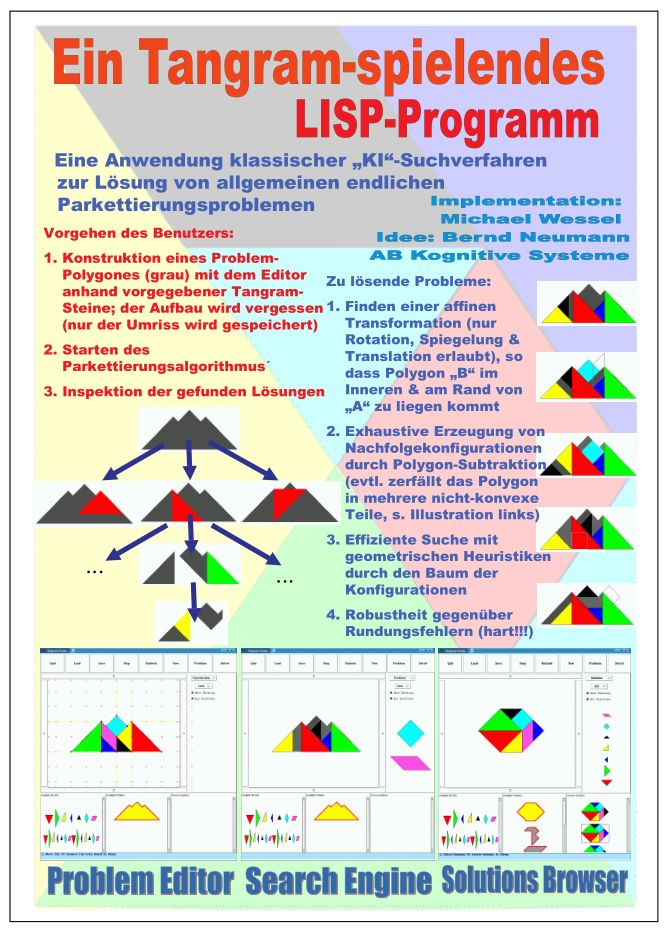
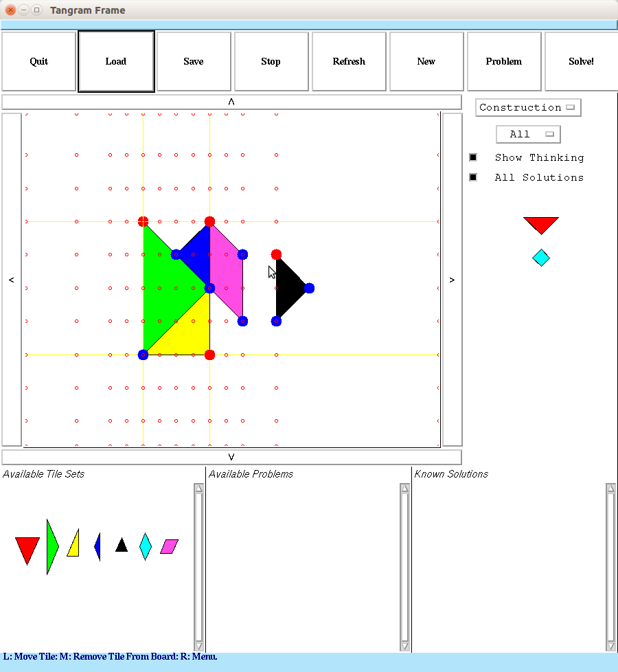
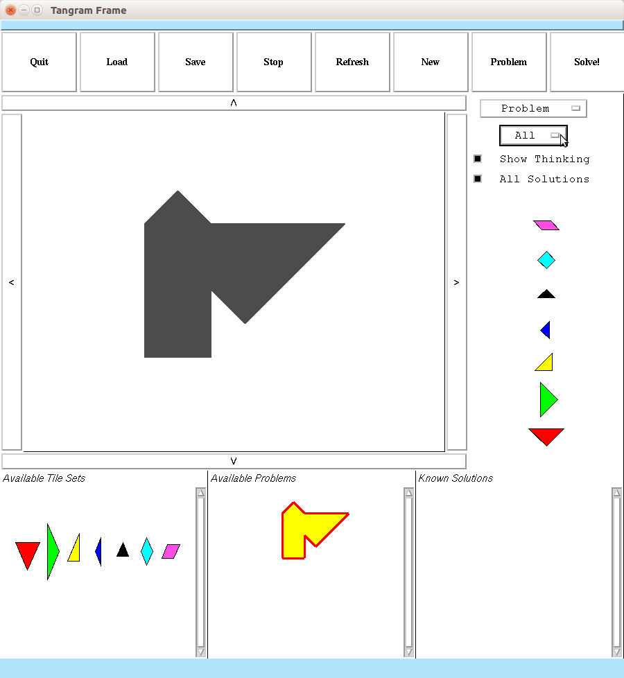
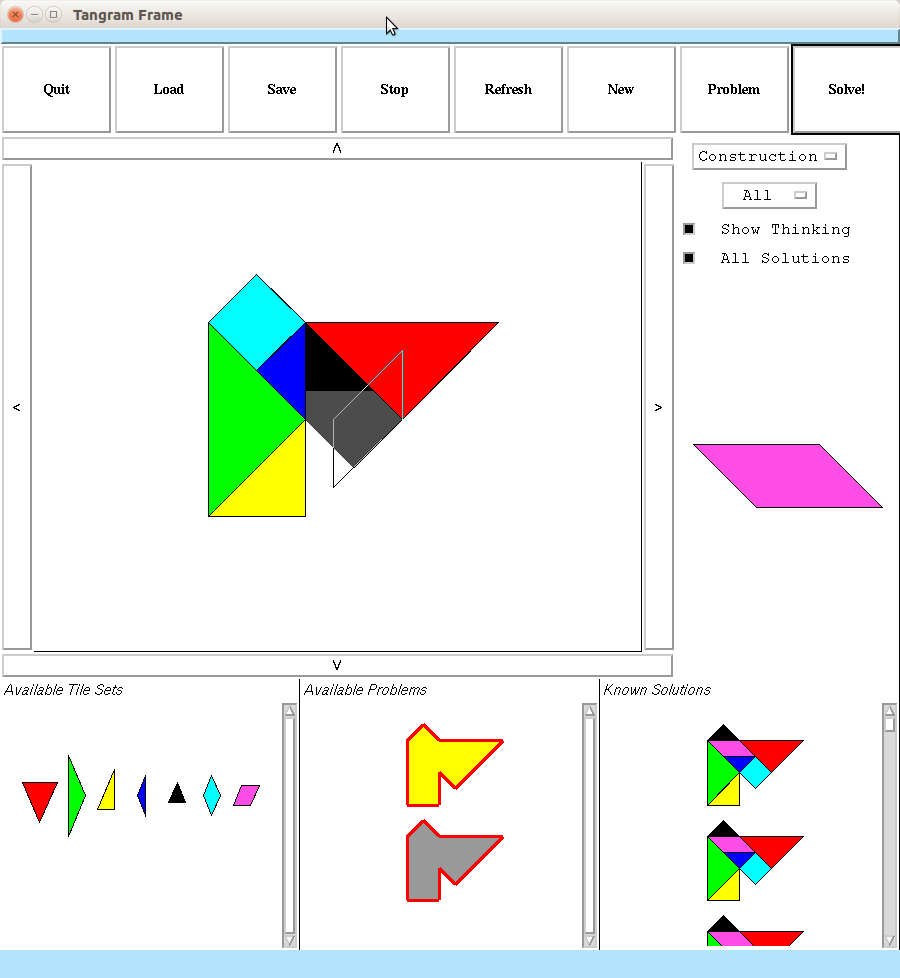
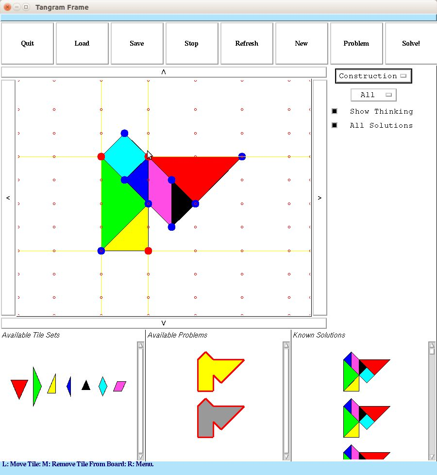
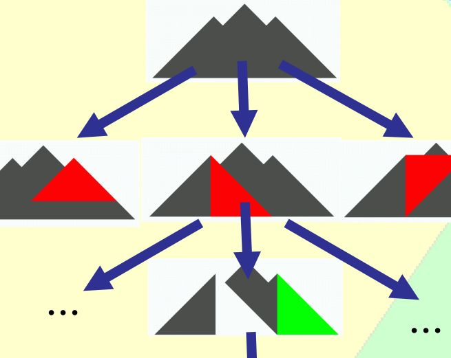
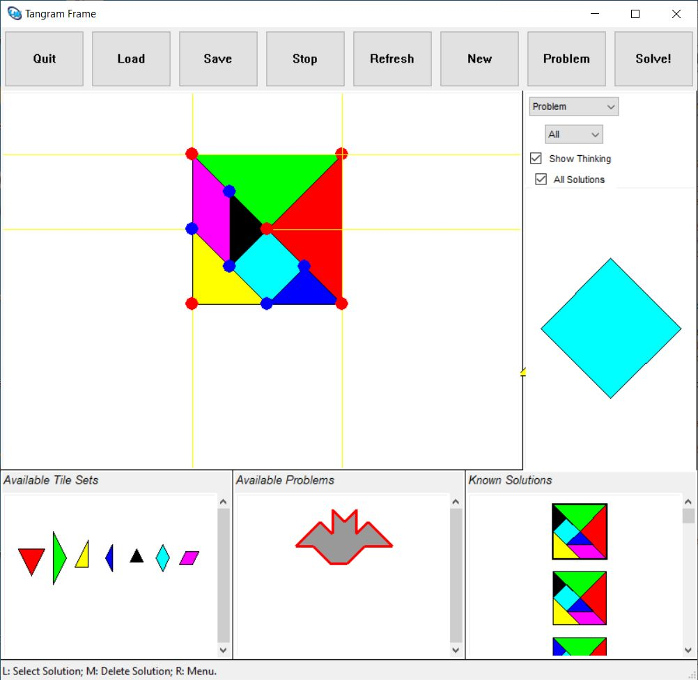
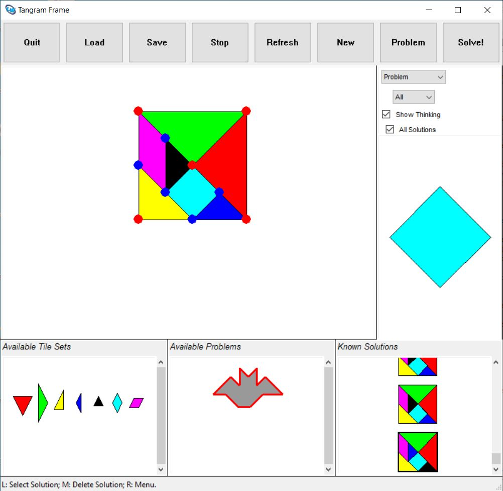
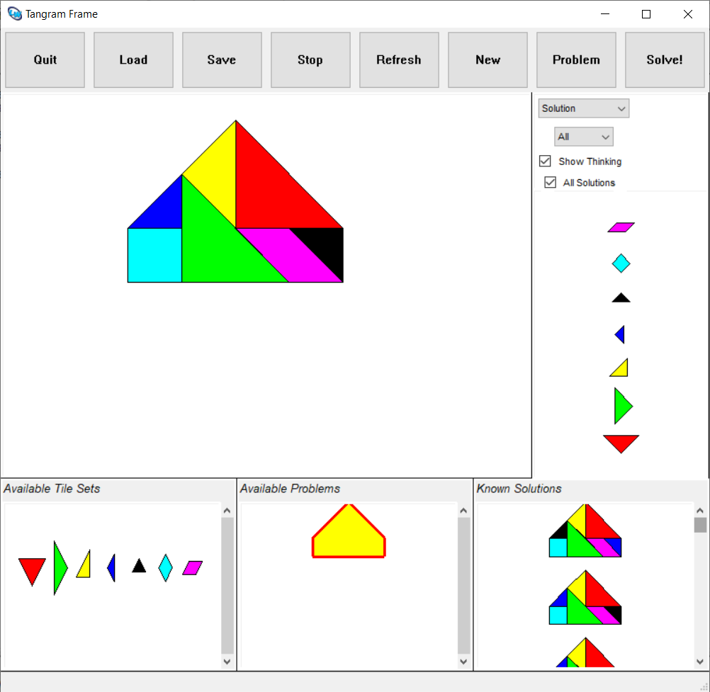

# Common-Lisp-Tangram-Solver
A Tangram Puzzle Solver in Common Lisp that is capable of solving arbitrary geometric tiling problems, utilizing CLIM (Common Lisp Interface Manager) for its GUI. 


## About 

This was written in Common Lisp in 2003, using CLIM (Common Lisp
Interface Manager) for its GUI. It compiles with LispWorks 6.1 and 7.1
with CLIM, on Windows, Linux, and Mac. I can only support Windows and
Linux, but it is known to run on a M1 Silicon Mac as well (see below).

Here is a [2003 poster about the project, in
German](tangram-poster.pdf), and here my [European Lisp Symposium '21
paper](tangram-paper.pdf), as well as the [slides of the talk.](tangram-talk.pdf)



Pleae check out [the YouTube video to see it in
action!](https://youtu.be/rnZzXUbuSi4), or try one of the supplied
executables to run on your own machine!

On my 2012 iCore 7 2.4 GZ 8 GB Ubuntu Xenial PC, thanks to its
geometric search heuristics, it takes ~ 10 seconds to solve the
following problem:






The solver uses geometric search: 



This is work in progress. The heuristics are being changed from time
to time. Currently, with the above machine configuration, it takes
about ~3 minutes and 50 seconds for it to solve the standard Tangram problem
if "Show Thinking" is unchecked, and ~6 minutes and 30 seconds with 
"Show Thinking" enabled: 



 

 Other problems are much faster. The solver frequently finds
innovative solutions. Problems in `.tan` format are
[`src/problems`](./src/problems) folder.

 

## History 

The program was written in 2003. I resurrected the code in March 2021
and fixed some major bugs that were responsible for severe 
incompleteness. It is performing much better by now!

The geometric substrate support functions were written by the author
during his computer science master and PhD endeavors, from 1996 to
2003.

## Installation (Windows, Linux, Mac)

You will need LisWorks (6.1, 7.1) with CLIM if you want to run it from
source, or even build the application. Else, exectuables are provided
for Linux32 and Windows (see below).

On Linux, I needed to install a number of (in my case, 32bit) legacy
libraries, like (32bit) Motif etc. in order to get is going. It is
much more straightforward with Windows (tested on 64bit Windows 10).

The well-known Lisp hacker `Lispm` (Rainer Joswig) reported that [it
runs fine on an Apple Silicon Mac with M1 processor under 64bit ARM
Linux.](https://twitter.com/RainerJoswig/status/1369401013308973060).

## Executables 

Here are the [provided executables for Linux32 and
Windows.](./builds/)

## Loading / Usage 

If you want to build it from source, check out the
[`src/tangram-sysdcl.lisp`](./src/tangram-sysdcl.lisp).  Adjust the
logical `"tangram"` pathname to match your environment. Then, as shown
at the end of the file, do a

```
(compile-system "tangram")
(load-system "tangram")
(tangram::tangram)

``` 

There are also [`deliver.lisp`](src/deliver.lisp) scripts provided for
[Linux32](build-tangram-lw61.sh) and
[Windows](build-tangram-lw61.bat).

For the Mac, you'll probably have to collect the "FLI Templates", and
then change the [`tangram-sysdcl.lisp`](./src/tangram-sysdcl.lisp)
accordingly: 

```
(define-system tangram
    (:default-pathname "tangram:")
    (:serial "tangram-packages"
   #+:linux
   "tangram-templates"
   tangram-aux tangram-persistence tangram-geometry
   tangram-main tangram-gui))
```

The process of "FLI template collection" is described [in the
LispWorks
manual.](http://www.lispworks.com/documentation/lw71/DV/html/delivery-167.htm)

Lisp hacker `Lispm` (Rainer Joswig) has [successfully delivered the
application with his Apple Silicon Mac with M1 processor under 64bit ARM
Linux.](https://twitter.com/RainerJoswig/status/1369401013308973060).

# Acknowledgements

Thanks to Rainer Joswig (`Lispm`) for checking it out with the new
Silicon Macs and LispWorks 7.1 (I only have 6.1), for spreading the
word, and for tipps regarding the application delivery process (FLI
template collection).

Enjoy! 

